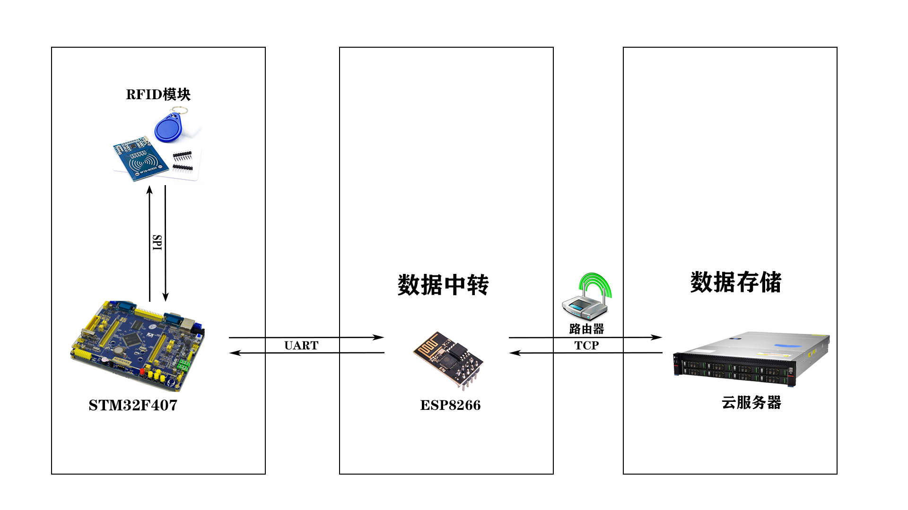

# BusChargeSystem-IOT

## 项目介绍

基于 STM32F407+ESP8266+RFID 的模拟公交车刷卡收费系统(物联网)

STM32 通过 RFID 识别获取卡片数据并通过串口发送到 esp8266，esp8266 通过网络与服务端进行交互，服务端处理数据后存储到数据库中，方便后续的增删改查操作。
做这个小小的项目过程中参考了很多正点原子的资料，很多东西都是刚开始学习，所以只会简单的实现一个物联网项目。

项目示意图：


## 1. 功能列表

| 功能     | 介绍                                            |
| :------- | :---------------------------------------------- |
| 添加用户 | 刷卡识别需要添加的用户                          |
| 删除用户 | 刷卡识别需要删除的用户                          |
| 刷卡消费 | 每次刷卡消费金额为 1 元，同一用户可连续刷卡消费 |
| 余额充值 | 通过按键选择充值金额并刷卡识别完成充值          |

## 2. 技术栈

### 2.1 环境

| 环境        | 版本          |
| :---------- | :------------ |
| 操作系统    | Windows/Linux |
| KeilMDK-ARM | 5.35          |
| Arduino     | 1.8.15        |
| Jdk         | 1.8           |
| Mysql       | 8.0           |

### 2.2 硬件端

- STM32F407
- ESP8266
- RFID 模块
- TFT LCD 液晶屏模块

### 2.3 服务端

- Java
- Mysql
- JDBC

## 3. 项目开发

### 3.1 项目代码文件结构简介

```
- BusChargeSystem-IOT
  - BusChargeSystem   STM32F407代码
  - BusChargeSystemService   服务端代码
  - esp8266   ESP8266代码
  - sql   mysql数据库脚本
```

### 3.2 硬件端开发

#### 3.2.1 开发说明

- .\BusChargeSystem\为 STM32F407 开发板的代码，请使用 Keil uVision5 集成开发工具打开\USER\BusChargeSystem.uvprojx 文件
- .\esp8266\为 esp8266 开发板的代码，请使用 Arduino 开发工具打开，修改服务器 IP 地址和端口

```cpp
// 服务器IP地址 和 端口
const char *host = "192.168.137.1"; // 本地测试的IP 后期改成云服务器的IP
const uint16_t port = 8888;
```

注：如果本地测试接收不数据，关闭防火墙后再进行测试

#### 3.2.2 硬件接线方式

| STM32F407 | RFID 模块 |
| --------- | --------- |
| PA4       | SDA       |
| PC10      | SCK       |
| PC12      | MOSI      |
| PC11      | MISO      |
| GND       | GND       |
| PA6       | RST       |
| 3.3V      | VCC       |

| STM32F407 | ESP8266 |
| --------- | ------- |
| 3.3V      | VCC     |
| GND       | GND     |
| PA9(TX)   | RX      |
| PA10(RX)  | TX      |

TFT LCD 液晶屏模块 --- STM32F407 开发板上固定位置插入

### 3.3 服务端开发

#### 3.3.1 开发说明

- .\sql\为数据库脚本，安装 mysql，导入 bus_charge_system.sql 脚本
- 数据库名称为：bus_charge_system
- 默认账号：BCSAdmin 密码：123456
- .\BusChargeSystem\为服务端代码，请使用 IntelliJ IDEA 打开此文件夹
- 启动服务端程序，默认监听端口为 8888

#### 3.3.2 数据库表

表名：user_tb

| 字段名      | 类型     | 注释                |
| :---------- | :------- | :------------------ |
| id          | int      | RFID 模块读卡的卡号 |
| name        | varchar  | 用户名              |
| sex         | char     |                     |
| age         | int      |                     |
| balance     | double   | 用户余额            |
| signup_time | datetime | 注册时间            |

## 4. 项目部署

### 4.1 硬件端部署

STM32F407:

- 使用 Keil uVision5 集成开发工具打开.\BusChargeSystem\USER\目录下的 BusChargeSystem.uvprojx 文件并编译
- 编译后会在.\BusChargeSystem\OBJ\目录下生成 BusChargeSystem.hex 文件，通过 FlyMcu 工具将此文件下载到开发板上 或 使用 DAP 仿真器

ESP8266:

- 用 Arduino 开发工具打开.\esp8266\目录下的 esp8266.ino 文件并将程序下载到开发板上

### 4.2 服务端部署

- 在数据库管理软件中导入./sql/目录下的 bus_charge_system.sql 脚本
- 将.\BusChargeSystemService 目录下的 Java 程序打包成 Jar 包并上传到云服务器
- 在云服务器上将 8888 端口加入安全组
- 在终端执行 Jar 包，命令如下：

  ```
  java -jar BusChargeSystemService.jar
  ```

## 5. 参考资料

[硬件资料](http://www.openedv.com/docs/boards/stm32/zdyz_stm32f407_explorer.html)

[正点原子@ALIENTEK](http://www.alientek.com/)
